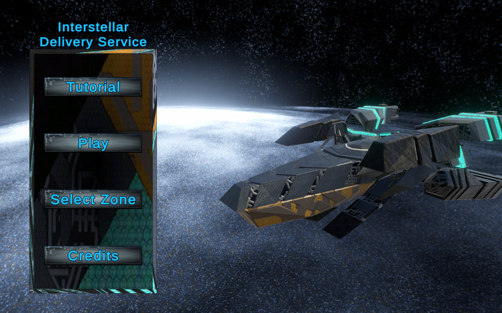
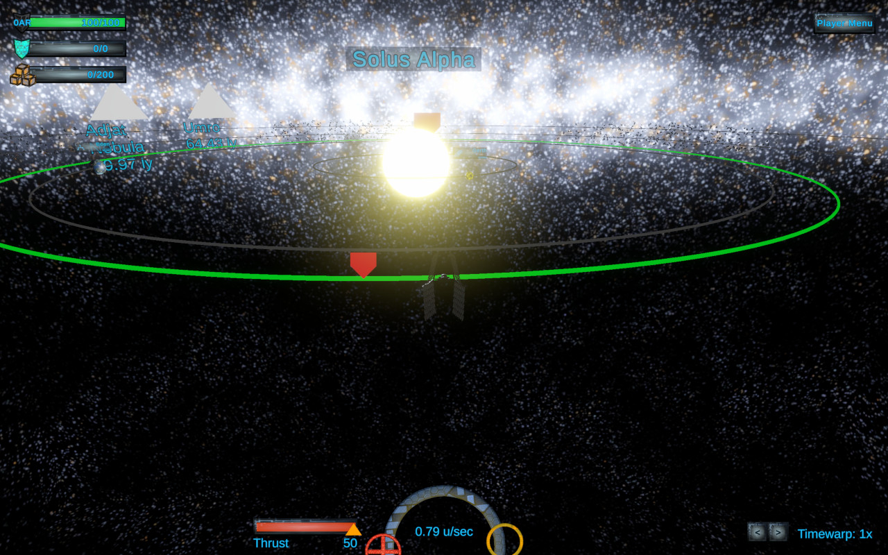
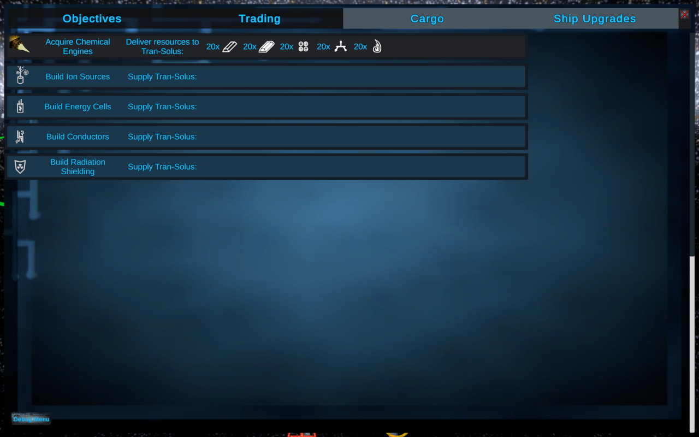
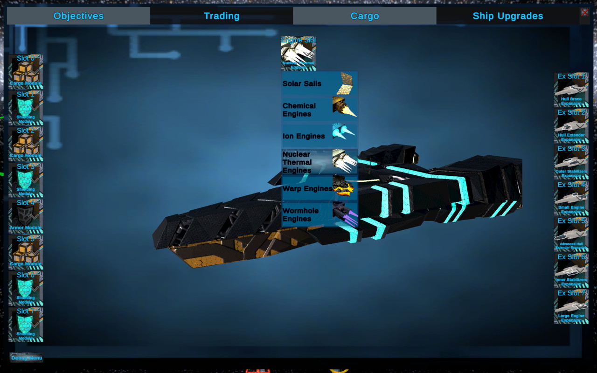
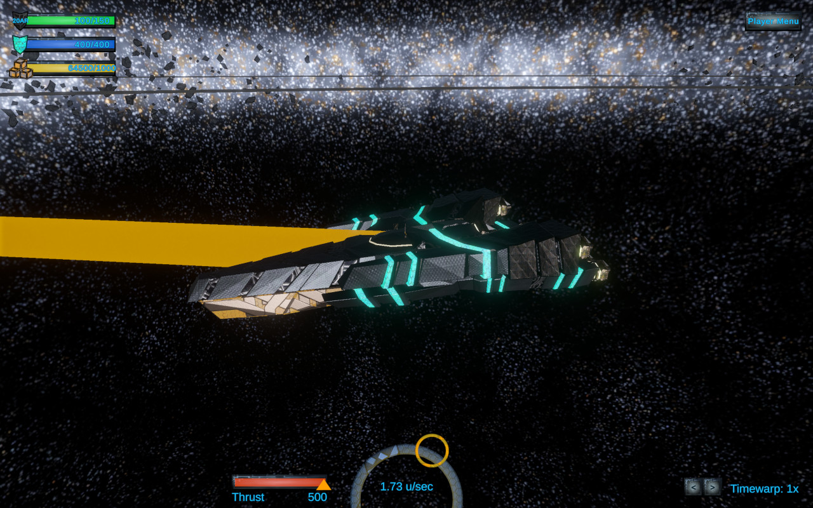
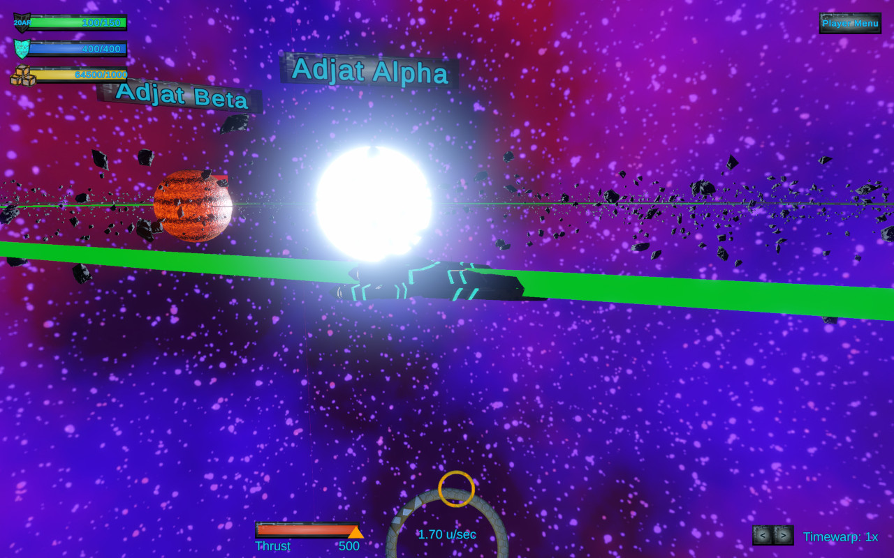
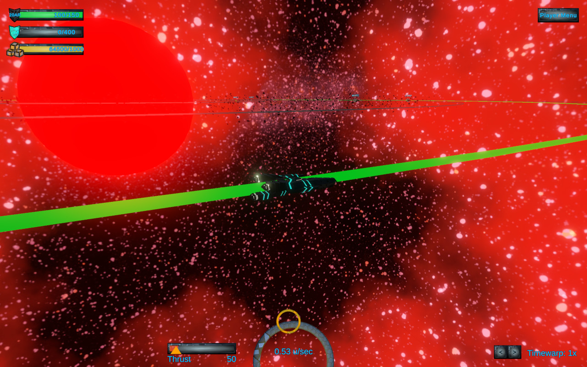
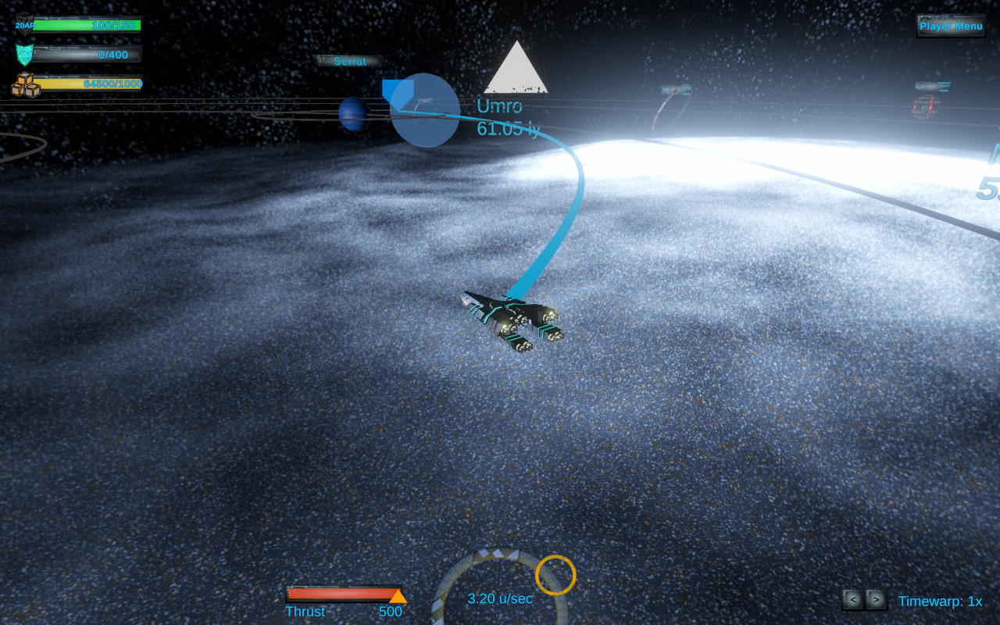

## Project Responsibilities
Cory:
Scene streaming
Main Menu
Player Menu
Made the art assets (3D models, sprites, skyboxes, and textures)
UI assets
Upgrade system.
Inventory system.

Kai:
Orbit system
Encounter prediction and visualization.
HUD
Scene transition arrows
Galactic coordinates system for scene transition arrows
Music sourcing
Sounds

## Game Overview
In this game the player navigates to different planets and star systems in order to deliver supplies and acquire ship upgrades. Navigation is done via a physically-based analytical orbit solver, and the player must intelligently adjust their orbit in order to intercept with planets. The systems and planets are represented by at a toy-scale with movement constrained to a 2D plane.

Once the player successfully delivers supplies to the space station for the system, they will be rewarded with several ship upgrades. This upgrades come in three varieties: engine upgrades, ship expansions, and slot upgrades. Engine upgrades increase the maximum ship thrust limit. Ship expansions add a new module on to the ship allowing an additional slot upgrade to be installed. Slot upgrades can be place in any of the ships available upgrade slots and come in three varieties: shields, armor, or cargo modules. These upgrades help the player survive the environmental hazards of each system, such as asteroids, stars, and a black hole.

*Objectives Menu*

*Upgrade Menu*

*Fully upgraded ship*

*Intercept course highlight*
